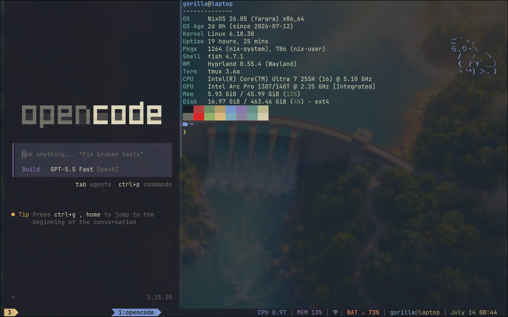
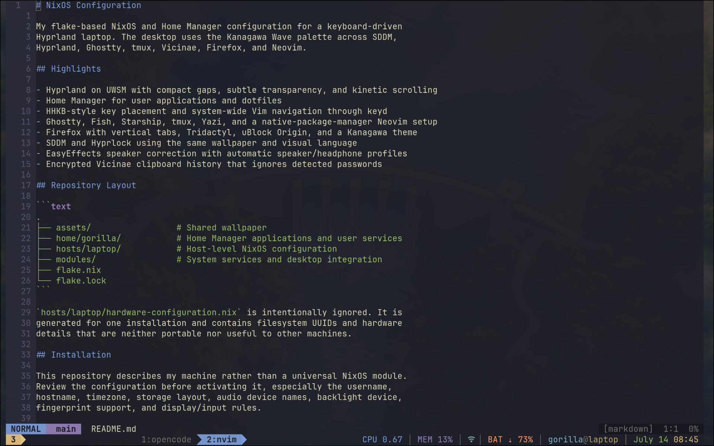

# NixOS Configuration


Terminal-centered, minimal NixOS and Home Manager configuration for a
keyboard-driven Hyprland laptop. The desktop uses the Kanagawa Wave palette
across SDDM, Hyprland, Ghostty, tmux, Vicinae, Firefox, and Neovim, with most
daily workflows staying inside a terminal-first setup.

This is a living personal system. The published configuration is usable and
documented, but the full desktop is still in progress and will keep changing as
the workflow settles.

## Screenshots





## Highlights

- Hyprland on UWSM with compact gaps, subtle transparency, and kinetic scrolling
- Home Manager for user applications and dotfiles
- HHKB-style key placement and system-wide Vim navigation through keyd
- Ghostty, Fish, Starship, tmux, Yazi, and a native-package-manager Neovim setup
- Firefox with vertical tabs, Tridactyl, uBlock Origin, and a Kanagawa theme
- SDDM and Hyprlock using the same wallpaper and visual language
- EasyEffects speaker correction with automatic speaker/headphone profiles
- Encrypted Vicinae clipboard history that ignores detected passwords

## Repository Layout

```text
.
├── assets/                 # Shared wallpaper
├── home/gorilla/           # Home Manager applications and user services
├── hosts/laptop/           # Host-level NixOS configuration
├── modules/                # System services and desktop integration
├── flake.nix
└── flake.lock
```

`hosts/laptop/hardware-configuration.nix` is intentionally ignored. It is
generated for one installation and contains filesystem UUIDs and hardware
details that are neither portable nor useful to other machines.

## Installation

This repository describes my machine rather than a universal NixOS module.
Review the configuration before activating it, especially the username,
hostname, timezone, storage layout, audio device names, backlight device,
fingerprint support, and display/input rules.

Back up the configuration generated by the NixOS installer, then clone:

```sh
sudo mv /etc/nixos /etc/nixos.backup
sudo git clone https://github.com/savonovv/nixos-config.git /etc/nixos
sudo chown -R "$USER":users /etc/nixos
cd /etc/nixos
```

Generate the local hardware configuration:

```sh
sudo nixos-generate-config --show-hardware-config \
  | sudo tee hosts/laptop/hardware-configuration.nix >/dev/null
```

Because flakes evaluate Git worktrees from files known to Git, make the ignored
hardware file visible to local flake evaluation without staging its contents:

```sh
git add -N -f hosts/laptop/hardware-configuration.nix
```

Do not commit that file unless you intentionally want to publish your local
filesystem UUIDs.

Change these values before building for another user or host:

- `gorilla` in `flake.nix`, `hosts/laptop/configuration.nix`, `home/gorilla/`,
  and `modules/sddm-theme/Main.qml`
- `laptop` in `flake.nix`, `hosts/laptop/`, and the Fish rebuild aliases
- `Asia/Dubai` in `hosts/laptop/configuration.nix`
- Machine-specific settings called out in `home/gorilla/audio.nix` and
  `home/gorilla/hypr/default.nix`

Evaluate without building:

```sh
nix flake check --no-build
```

Build without activating:

```sh
nix build .#nixosConfigurations.laptop.config.system.build.toplevel --no-link
```

Activate:

```sh
sudo nixos-rebuild switch --flake .#laptop
```

## The HHKB-Style Layout

The layout grew from two related goals: keeping my hands close to the home row
and carrying Vim muscle memory into applications that do not understand Vim
keys. An HHKB puts Control where Caps Lock normally sits and Escape where the
grave key normally sits. Those positions make both keys easier to reach without
twisting a hand away from the typing position.

keyd applies the remapping below at the input-device level, so it works in
Wayland applications, XWayland applications, terminals, login prompts, and
TTYs. Caps is always Control; it is not a dual-role key.

| Input | Output |
| --- | --- |
| Caps Lock | Control |
| Grave | Escape |
| Shift + Grave | `~` |
| Alt + Grave | `` ` `` |
| Control + H/J/K/L | Left/Down/Up/Right |
| Control + comma/period/slash | Previous/next/play-pause |
| Right Alt + H/J/K/L | Left/Down/Up/Right |
| Right Alt + comma/period/slash | Previous/next/play-pause |

Most Control shortcuts remain normal. keyd only replaces the explicitly listed
keys, which means `Ctrl+C`, `Ctrl+V`, and similar combinations keep working,
while `Ctrl+H/J/K/L` become application-independent arrow keys. The Right Alt
layer duplicates navigation for cases where I want arrows without occupying the
Control modifier.

If a broken keyd mapping makes the keyboard unusable, keyd's panic sequence is
Backspace + Escape + Enter.

## Neovim

Neovim is kept in one grouped Lua file and uses the native `vim.pack` package
manager. `nvim-pack-lock.json` pins the plugin revisions used by this setup. It
includes native LSP completion, Treesitter, mini.pick, nvim-tree, Fugitive,
which-key, and GDB-backed DAP support without an external plugin manager.

## Machine-Specific Notes

The EasyEffects autoload profile targets the laptop's current PipeWire device
names. Battery notifications and the tmux status line expect `BAT0`, brightness
controls expect `intel_backlight`, and fingerprint authentication is enabled for
Hyprlock. Adjust or remove those settings on different hardware.

## Privacy And Secrets

No credentials, browser data, Wi-Fi profiles, or private keys belong in this
repository. `.gitignore` excludes the generated hardware configuration and
common plaintext secret formats, but ignored files are not a substitute for a
secret manager. Use an encrypted system such as sops-nix or agenix before adding
declarative secrets.

The Firefox profile path in `firefox.nix` is a local profile identifier, not a
Firefox account identifier. The configuration does not include browser history,
cookies, saved logins, or session data.

`assets/wallpaper.png` contains C2PA provenance identifying it as AI-generated
media. It contains no GPS, camera, account, or credential metadata.

## License

MIT. See [LICENSE](LICENSE).
